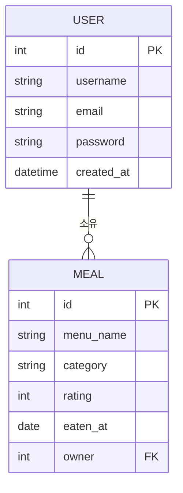

# ERD 테이블 정리

## User (accounts)
- id
- username
- email        ← 중복 불가
- password     ← 해시 저장
- created_at

## Meal (meals)
- id
- menu_name    ← 메뉴명
- category     ← 한식/중식/양식/분식
- rating       ← 1~5
- eaten_at     ← 먹은 날짜
- owner        ← User FK

## 테이블 관계
- User ──< Meal (1:N)
(1명의 유저가 여러 식사 기록 가능)

# ERD

